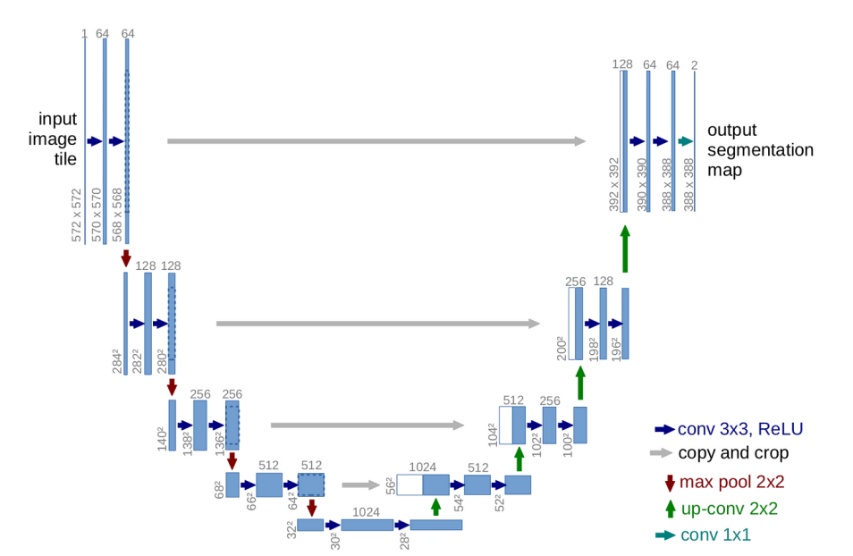
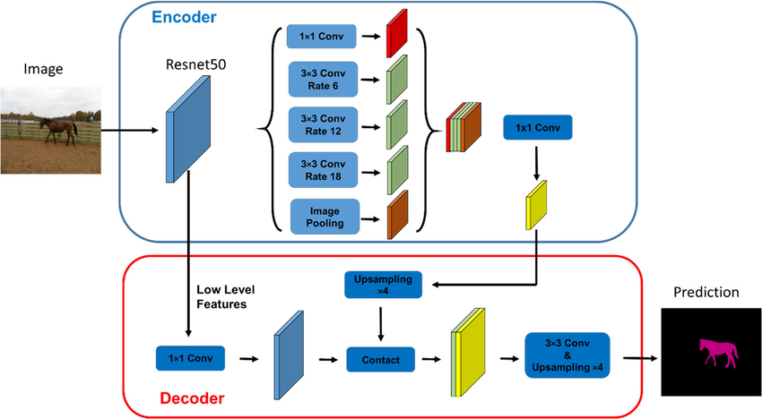
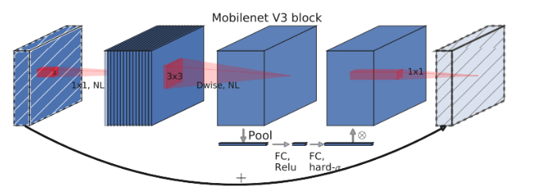
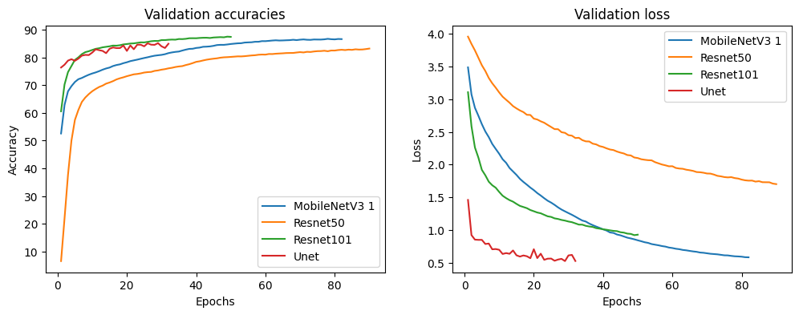
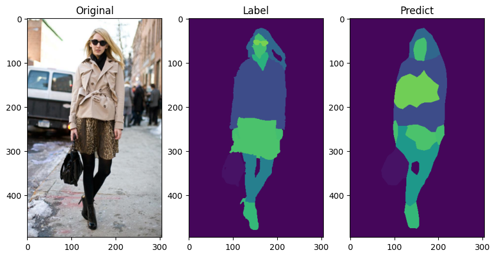

# ClothVision project

## Introduction

This research focuses on applying advanced image segmentation techniques to human clothing,
with potential applications in various domains. Our goal is to implement optimized models, including U-net, MobileNetV3, 
ResNet50, and ResNet101, tailored for precise clothing segmentation in images. Beyond model implementation and evaluation, 
we aim to establish a robust methodology serving as a reference for future research.

In a broader context, the project aligns with global security priorities, exploring the visual identification of individuals
based on their attire. This capability could prove crucial in early detection of unusual or suspicious clothing, enhancing prevention
and response measures in public security settings.

## Dataset

The dataset [Clothing Co-Parsing Dataset](https://www.kaggle.com/datasets/balraj98/clothing-coparsing-dataset) from Kaggle. 
This dataset provides detailed information about clothing in images of individuals. The "labels" folder, designated for prediction or segmentation labels, 
is further divided into two subfolders: one containing 1004 segmentation images, corresponding to another set of 1004 original input images. Additionally, there is a folder 
with 1098 text files corresponding to the remaining images, providing information about the clothing in the original
images but without segmentation details. Given the significance of segmentation, we opted for the first 1004 images from the dataset, along with their corresponding 1004 segmentation labels.

## Project Components

- **LabelEncoder**
  - Encodes label images for model efficiency.

- **LabelDecoder**
  - Responsible for decoding encoded label images.

- **models**
  - Folder containing various model architectures, including ResNet50, ResNet101, U-net, and MobileNetV3.

- **EarlyStopper**
  - Halts training at the opportune moment.

- **trainers**
  - Folder with specific classes for model training, providing straightforward results visualization. It includes:
    - `ModelTrainer` for custom models.
    - `TransferLearningTrainer` for pre-trained models.

- **CustomClothingDataset**
  - Class responsible for loading data into memory for use by PyTorch DataLoaders during training.

## Training Parameters
For all training sessions, the same loss function, optimizer, and learning rate scheduler were used.

- **CrossEntropy Loss**
  - Measures the discrepancy between predicted and actual probability distributions, ideal for multi-class problems.

- **Adam Optimizer**
  - One of the top-performing optimizers known for fast convergence. 

- **ReduceLROnPlateau**
  - Convenient for dynamically adjusting the learning rate, triggering changes only when a metric stops improving.

## Segmentation Models

Detailed descriptions of the image segmentation models implemented in this project,
each designed to tackle the specific task of identifying clothing in images of individuals.

### U-net
The U-net architecture is renowned for its ability to achieve precise segmentation by combining features from different scales.
Its encoder-decoder structure facilitates pattern recognition across various hierarchies.

*Figure 1: U-net Architecture*

In this project, U-net is adapted to capture fine details in clothing images, 
proving particularly useful for its ability to recognize features at different levels of abstraction. However, 
its drawback lies in the potential loss of contextual information in broader regions of the image.

### ResNet
ResNet50 and ResNet101 architectures stand out for their residual connections, allowing the training of deep networks
without suffering from performance degradation.

*Figure 2: ResNet 50 Architecture*

These models are valuable for clothing segmentation due to their ability to capture features of varying complexity.
ResNet101, being deeper, may potentially learn more detailed representations but comes with additional computational costs. ResNet50, 
on the other hand, strikes a balance between performance and efficiency.

A specifically utilized version is **DeepLabV3** of ResNet50, pretrained with **ImageNet** as a backbone. This enables transfer 
learning, leveraging useful representations learned from a diverse range of images, which proves beneficial when working with 
smaller datasets.

### MobileNetV3
MobileNetV3 stands out for its computational efficiency and suitability for running on devices with limited resources.

*Figure 3: MobileNetV3 Architecture*

In the context of clothing segmentation, its lightweight structure allows for fast image processing, beneficial for real-time applications or environments with hardware constraints. However, its main limitation lies in the potential loss of fine details due to its efficiency-focused approach.

For this architecture, the associated DeepLabV3 has also been leveraged to reap the advantages mentioned above.

## Usage

### preprocess.py

This is the first file that should be executed, the function preprocess inside it, reads the data of the dataset that
must be inside a folder "./data" and preprocess all tensors for the network into local files.

### train.py

Using the function train, inside this file, you train and save an U-net model, in order to change the model, 
just change the function that creates the trainer, from "get_unet_trainer" to another model trainer.

### img_test.py

Use test_with_image(image_file) in order to view the results of an image.

## Results

## Results

Below, we present a graphical representation of a portion of the table data:

    
    
<em>Figure 1: Graphical Results</em>

In Figure 1, illustrating the loss and accuracy for each architecture on the validation set, we observe that ResNet50
may require more epochs, and U-net might benefit from a lower learning rate. Additionally, the choice between MobileNetV3
with superior loss and ResNet101 with better accuracy is subject to debate.

Despite the minimal difference between these two networks, ***MobileNetV3*** weighs three times less than ResNet101, making 
it the preferred network for this use case. To illustrate, one of its results is provided below:

    
    
<em>Figure 2: Result Example</em>

Real classes: ['none', 'hair', 'skin', 'blouse', 'bag', 'dress', 'purse', 'boots']'

Predicted classes: ['none', 'hair', 'skin', 'coat', 'jacket', 'shirt','blouse', 'dress', 'pants', 'bag', 'shoes']

In Figure 2, changes in lighting conditions appear to pose challenges for the model in accurately predicting clothing types,
as it visualizes different garment types in the same locations and even obscures certain parts.

## Authors

_David Cruz Sanchez_ - Data Scientist & Engineer
_Krish Sadhwani_ - Data Scientist & Engineer
